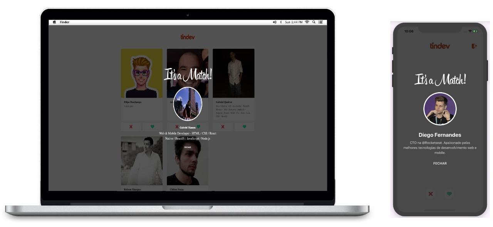

  <a href="https://github.com/gmass0n/tindev">
    
  <a href="https://github.com/gmass0n/tindev">
  <h3 align="center">Tindev WEB & Mobile</h3>
  

  Application developed in OmniStack 8.0 similar to Tinder, but for developers.
   
   
  Profiles will be returned from Github, both on the web and mobile will be possible to LIKE or DISLIKE.
   
   
  The project contains the technology of Socket.io, which is a library that allows applications to communicate in real time, so if two developers LIKE each other, a message will appear on screen for both.
   
   
   
 

  
  

